## Opis problemu

Na przestrzeni ostatnich lat zauważono stopniowy spadek rozmiaru śledzia oceanicznego wyławianego w Europie. Do analizy zebrano pomiary śledzi i warunków w jakich żyją z ostatnich 60 lat. Dane były pobierane z połowów komercyjnych jednostek. W ramach połowu jednej jednostki losowo wybierano od 50 do 100 sztuk trzyletnich śledzi.

## Wnioski

TODO

## Wstęp

### Biblioteki


```r
library(dplyr)
library(knitr)
library(pander)
library(tidyverse)
library(gridExtra)
library(imputeTS)
library(corrplot)
library(plotly)
```

### Powtarzalność eksperymentów

W celu zapewnienia powtarzalności wyników dla uruchamianego wielokrotnie ustawiono ziarno (ang. seed) na wartość 13.


```r
set.seed(13)
```

### Ładowanie i prezentacja danych

Dane zostana załadowane bezpośrednio z pliku csv pochodzącego ze strony z zadaniem.


```r
download.file(
  "http://www.cs.put.poznan.pl/dbrzezinski/teaching/sphd/sledzie.csv",
  destfile = 'sledzie.csv'
)

data <- read.csv("sledzie.csv", header = TRUE, sep = ",", na.strings = "?") %>% rename(id = X)
```


Zbiór zawiera 16 kolumn i 52582 wierszy. Kolumny mają następujące nazwy: id, length, cfin1, cfin2, chel1, chel2, lcop1, lcop2, fbar, recr, cumf, totaln, sst, sal, xmonth, nao. Prezentacja pierwszych 10 wierszy:


```r
kable(head(data, 10))
```


 id   length     cfin1     cfin2     chel1      chel2     lcop1      lcop2    fbar     recr        cumf     totaln        sst        sal   xmonth   nao
---  -------  --------  --------  --------  ---------  --------  ---------  ------  -------  ----------  ---------  ---------  ---------  -------  ----
  0     23.0   0.02778   0.27785   2.46875         NA   2.54787   26.35881   0.356   482831   0.3059879   267380.8   14.30693   35.51234        7   2.8
  1     22.5   0.02778   0.27785   2.46875   21.43548   2.54787   26.35881   0.356   482831   0.3059879   267380.8   14.30693   35.51234        7   2.8
  2     25.0   0.02778   0.27785   2.46875   21.43548   2.54787   26.35881   0.356   482831   0.3059879   267380.8   14.30693   35.51234        7   2.8
  3     25.5   0.02778   0.27785   2.46875   21.43548   2.54787   26.35881   0.356   482831   0.3059879   267380.8   14.30693   35.51234        7   2.8
  4     24.0   0.02778   0.27785   2.46875   21.43548   2.54787   26.35881   0.356   482831   0.3059879   267380.8   14.30693   35.51234        7   2.8
  5     22.0   0.02778   0.27785   2.46875   21.43548   2.54787         NA   0.356   482831   0.3059879   267380.8   14.30693   35.51234        7   2.8
  6     24.0   0.02778   0.27785   2.46875   21.43548   2.54787   26.35881   0.356   482831   0.3059879   267380.8   14.30693   35.51234        7   2.8
  7     23.5   0.02778   0.27785   2.46875   21.43548   2.54787   26.35881   0.356   482831   0.3059879   267380.8   14.30693   35.51234        7   2.8
  8     22.5   0.02778   0.27785   2.46875   21.43548   2.54787   26.35881   0.356   482831   0.3059879   267380.8   14.30693   35.51234        7   2.8
  9     22.5   0.02778   0.27785   2.46875   21.43548   2.54787   26.35881   0.356   482831   0.3059879   267380.8   14.30693   35.51234        7   2.8

## Opis danych

### Opis kolumn:

Nazwa | Opis
---------|--------------------------------------------
length: | długość złowionego śledzia [cm]
cfin1:  | dostępność planktonu [zagęszczenie Calanus finmarchicus gat. 1]
cfin2:  | dostępność planktonu [zagęszczenie Calanus finmarchicus gat. 2]
chel1:  | dostępność planktonu [zagęszczenie Calanus helgolandicus gat. 1]
chel2:  | dostępność planktonu [zagęszczenie Calanus helgolandicus gat. 2]
lcop1:  | dostępność planktonu [zagęszczenie widłonogów gat. 1]
lcop2:  | dostępność planktonu [zagęszczenie widłonogów gat. 2]
fbar:   | natężenie połowów w regionie [ułamek pozostawionego narybku]
recr:   | roczny narybek [liczba śledzi]
cumf:   | łączne roczne natężenie połowów w regionie [ułamek pozostawionego narybku]
totaln: | łączna liczba ryb złowionych w ramach połowu [liczba śledzi]
sst:    | temperatura przy powierzchni wody [°C]
sal:    | poziom zasolenia wody [Knudsen ppt]
xmonth: | miesiąc połowu [numer miesiąca]
nao:    | oscylacja północnoatlantycka [mb]

Wiersze w zbiorze są uporządkowane chronologicznie.

### Typy danych

Prezentacja typów kolumn:


```r
glimpse(data)
```

```
## Observations: 52,582
## Variables: 16
## $ id     <int> 0, 1, 2, 3, 4, 5, 6, 7, 8, 9, 10, 11, 12, 13, 14, 15, 16, 17...
## $ length <dbl> 23.0, 22.5, 25.0, 25.5, 24.0, 22.0, 24.0, 23.5, 22.5, 22.5, ...
## $ cfin1  <dbl> 0.02778, 0.02778, 0.02778, 0.02778, 0.02778, 0.02778, 0.0277...
## $ cfin2  <dbl> 0.27785, 0.27785, 0.27785, 0.27785, 0.27785, 0.27785, 0.2778...
## $ chel1  <dbl> 2.46875, 2.46875, 2.46875, 2.46875, 2.46875, 2.46875, 2.4687...
## $ chel2  <dbl> NA, 21.43548, 21.43548, 21.43548, 21.43548, 21.43548, 21.435...
## $ lcop1  <dbl> 2.54787, 2.54787, 2.54787, 2.54787, 2.54787, 2.54787, 2.5478...
## $ lcop2  <dbl> 26.35881, 26.35881, 26.35881, 26.35881, 26.35881, NA, 26.358...
## $ fbar   <dbl> 0.356, 0.356, 0.356, 0.356, 0.356, 0.356, 0.356, 0.356, 0.35...
## $ recr   <int> 482831, 482831, 482831, 482831, 482831, 482831, 482831, 4828...
## $ cumf   <dbl> 0.3059879, 0.3059879, 0.3059879, 0.3059879, 0.3059879, 0.305...
## $ totaln <dbl> 267380.8, 267380.8, 267380.8, 267380.8, 267380.8, 267380.8, ...
## $ sst    <dbl> 14.30693, 14.30693, 14.30693, 14.30693, 14.30693, 14.30693, ...
## $ sal    <dbl> 35.51234, 35.51234, 35.51234, 35.51234, 35.51234, 35.51234, ...
## $ xmonth <int> 7, 7, 7, 7, 7, 7, 7, 7, 7, 7, 7, 6, 6, 6, 6, 6, 6, 6, 6, 6, ...
## $ nao    <dbl> 2.8, 2.8, 2.8, 2.8, 2.8, 2.8, 2.8, 2.8, 2.8, 2.8, 2.8, 2.8, ...
```

### Podsumowanie rozkładów


```r
pander(summary(data))
```


------------------------------------------------------------------
      id            length           cfin1             cfin2      
--------------- -------------- ----------------- -----------------
   Min.  : 0     Min.  :19.0    Min.  : 0.0000    Min.  : 0.0000  

 1st Qu.:13145   1st Qu.:24.0   1st Qu.: 0.0000   1st Qu.: 0.2778 

 Median :26291   Median :25.5   Median : 0.1111   Median : 0.7012 

  Mean :26291     Mean :25.3     Mean : 0.4458     Mean : 2.0248  

 3rd Qu.:39436   3rd Qu.:26.5   3rd Qu.: 0.3333   3rd Qu.: 1.7936 

 Max.  :52581    Max.  :32.5    Max.  :37.6667    Max.  :19.3958  

      NA              NA          NA's :1581        NA's :1536    
------------------------------------------------------------------

Table: Table continues below

 
---------------------------------------------------------------------
     chel1            chel2             lcop1             lcop2      
---------------- ---------------- ------------------ ----------------
 Min.  : 0.000    Min.  : 5.238     Min.  : 0.3074    Min.  : 7.849  

 1st Qu.: 2.469   1st Qu.:13.427   1st Qu.: 2.5479    1st Qu.:17.808 

 Median : 5.750   Median :21.673   Median : 7.0000    Median :24.859 

  Mean :10.006     Mean :21.221     Mean : 12.8108     Mean :28.419  

 3rd Qu.:11.500   3rd Qu.:27.193   3rd Qu.: 21.2315   3rd Qu.:37.232 

 Max.  :75.000    Max.  :57.706    Max.  :115.5833    Max.  :68.736  

   NA's :1555       NA's :1556        NA's :1653        NA's :1591   
---------------------------------------------------------------------

Table: Table continues below

 
----------------------------------------------------------------------
      fbar             recr              cumf             totaln      
---------------- ----------------- ----------------- -----------------
 Min.  :0.0680    Min.  : 140515    Min.  :0.06833    Min.  : 144137  

 1st Qu.:0.2270   1st Qu.: 360061   1st Qu.:0.14809   1st Qu.: 306068 

 Median :0.3320   Median : 421391   Median :0.23191   Median : 539558 

  Mean :0.3304     Mean : 520367     Mean :0.22981     Mean : 514973  

 3rd Qu.:0.4560   3rd Qu.: 724151   3rd Qu.:0.29803   3rd Qu.: 730351 

 Max.  :0.8490    Max.  :1565890    Max.  :0.39801    Max.  :1015595  

       NA               NA                NA                NA        
----------------------------------------------------------------------

Table: Table continues below

 
-------------------------------------------------------------------
      sst             sal            xmonth             nao        
--------------- --------------- ---------------- ------------------
 Min.  :12.77    Min.  :35.40    Min.  : 1.000    Min.  :-4.89000  

 1st Qu.:13.60   1st Qu.:35.51   1st Qu.: 5.000   1st Qu.:-1.89000 

 Median :13.86   Median :35.51   Median : 8.000   Median : 0.20000 

  Mean :13.87     Mean :35.51     Mean : 7.258     Mean :-0.09236  

 3rd Qu.:14.16   3rd Qu.:35.52   3rd Qu.: 9.000   3rd Qu.: 1.63000 

 Max.  :14.73    Max.  :35.61    Max.  :12.000    Max.  : 5.08000  

  NA's :1584          NA               NA                NA        
-------------------------------------------------------------------

## Oczyszczanie danych

### Wyświetlenie odstających


```r
barplot(unlist(allOut), main="Procent wartości odstajacych", horiz=TRUE, las=2, cex.names=0.7)
```

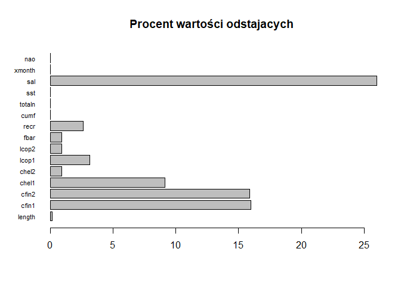<!-- -->

Na podstawie wykresów obrazujących rozkład wartości można wnioskować że dla atrybutów sal oraz cfin1 występują wartości odstające. Należy te wartości dokładniej zwyryfikować na graficznych wykresach rozkładów wartości.

### Oczyszczanie z odstajacych

Na każdym z wykresów przedstawiono rozkład wartości każdego kolejnego atrybutu ze zbioru. W przypadku wystąpienia wartości wyraźnie skrajnych, będą one zastepowane brakiem wartości (N/A).

#### Długość śledzia


```r
p_length <- ggplot(data, aes(length)) +
     geom_histogram(binwidth = 0.5) +  
     scale_x_discrete(name="Długość [cm]", limits= seq(min(data$length), max(data$length), by=1) ) +
     ylab("Liczba wystąpień") +
     ggtitle("Długość śledzia") + 
     theme(plot.title = element_text(hjust = 0.5))
```

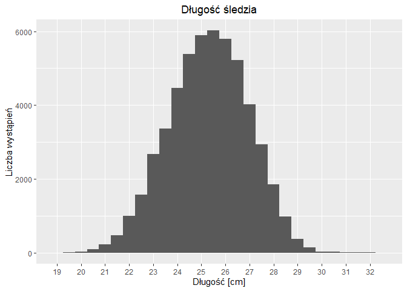<!-- -->

Komentarz: rozkład zbliżony do normalnego. Nie ma potrzeby zmian.

#### Zagęszczenie planktonu


```r
p_cfin1 <- ggplot(data, aes(cfin1)) +
  geom_histogram(binwidth = 1.0) + 
  xlab("Zagęszczenie planktonu") +
  ylab("Liczba wystąpień") + ggtitle("Calanus finmarchicus gat. 1") + 
  theme(plot.title = element_text(hjust = 0.5))
p_cfin2 <- ggplot(data, aes(cfin2)) +
  geom_histogram(binwidth = 1.0) +
  xlab("Zagęszczenie planktonu") +  
  ylab("Liczba wystąpień") + 
  ggtitle("Calanus finmarchicus gat. 2") +
  theme(plot.title = element_text(hjust = 0.5))
grid.arrange(p_cfin1, p_cfin2, ncol = 2, nrow = 1)
```

```
## Warning: Removed 1581 rows containing non-finite values (stat_bin).
```

```
## Warning: Removed 1536 rows containing non-finite values (stat_bin).
```

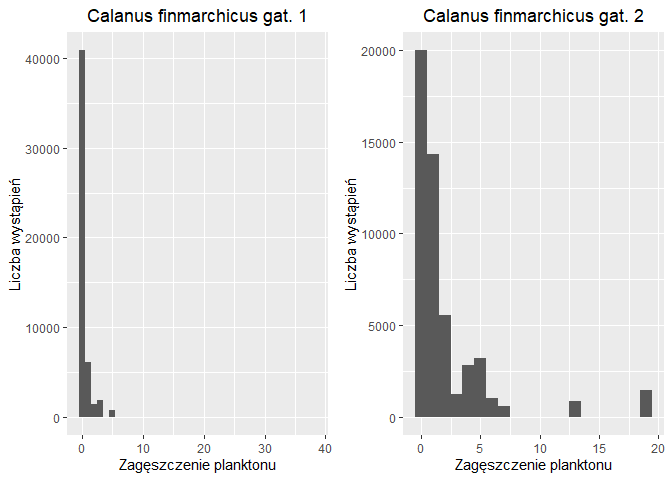<!-- -->

Komentarz: rozklady zbliżone do prawostronnie skośnego. Dla Calanus finmarchicus gat. 1 warto usunąć wartości odstające, które prawdopodobnie sa błędnie zebranymi danymi. Poniżej prezentacja porpawionego rozkładu.


```r
cfin1ToRepleace <- which(data$cfin1 > 20)
for (i in cfin1ToRepleace){
  data[i, "cfin1"] <- NA
}
data$cfin1 <- na.interpolation(data$cfin1)
```

```
## Warning: na.interpolation will replaced by na_interpolation.
##            Functionality stays the same.
##            The new function name better fits modern R code style guidelines.
##            Please adjust your code accordingly.
```


```r
p_cfin1 <- ggplot(data, aes(cfin1)) +
  geom_histogram(binwidth = 1.0) + 
  xlab("Zagęszczenie planktonu") +
  ylab("Liczba wystąpień") + ggtitle("Poprawione: Calanus finmarchicus gat. 1") + 
  theme(plot.title = element_text(hjust = 0.5))
plot(p_cfin1)
```

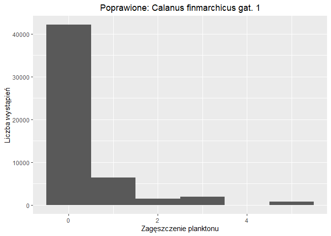<!-- -->


```r
p_chel1 <- ggplot(data, aes(chel1)) +
  geom_histogram(binwidth = 1.0) + 
  xlab("Zagęszczenie planktonu") +
  ylab("Liczba wystąpień") +
  ggtitle("Calanus helgolandicus gat. 1") +
  theme(plot.title = element_text(hjust = 0.5))
p_chel2 <- ggplot(data, aes(chel2)) +
  geom_histogram(binwidth = 1.0) +
  xlab("Zagęszczenie planktonu") +  
  ylab("Liczba wystąpień") + 
  ggtitle("Calanus helgolandicus gat. 2") + 
  theme(plot.title = element_text(hjust = 0.5))
grid.arrange(p_chel1, p_chel2, ncol = 2, nrow = 1)
```

```
## Warning: Removed 1555 rows containing non-finite values (stat_bin).
```

```
## Warning: Removed 1556 rows containing non-finite values (stat_bin).
```

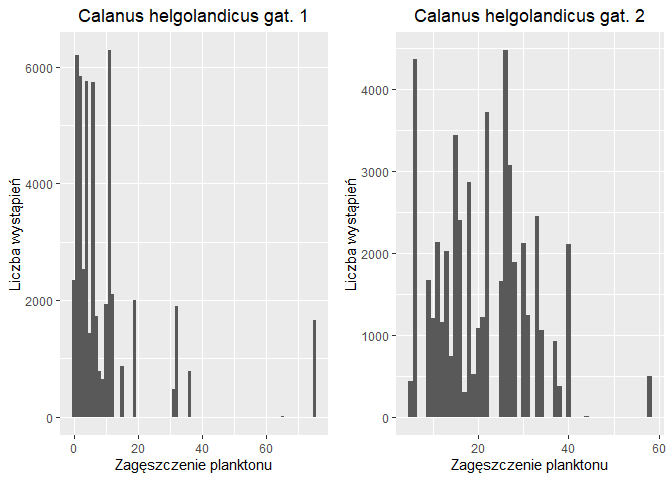<!-- -->

Komentarz: rozklady zbliżone do prawostronnie skośnego. Nie ma potrzeby zmian.


```r
p_lcop1 <- ggplot(data, aes(x=lcop1)) +
  geom_histogram(binwidth = 1.0) +
  xlab("Zagęszczenie planktonu") +
  ylab("Liczba wystąpień") + 
  ggtitle("Widłonogi gat. 1") +
  theme(plot.title = element_text(hjust = 0.5))
p_lcop2 <- ggplot(data, aes(x=lcop2)) + 
  geom_histogram(binwidth = 1.0) +  
  xlab("Zagęszczenie planktonu") +  
  ylab("Liczba wystąpień") + 
  ggtitle("Widłonogi gat. 2") + 
  theme(plot.title = element_text(hjust = 0.5))
grid.arrange(p_lcop1, p_lcop2, ncol = 2, nrow = 1)
```

```
## Warning: Removed 1653 rows containing non-finite values (stat_bin).
```

```
## Warning: Removed 1591 rows containing non-finite values (stat_bin).
```

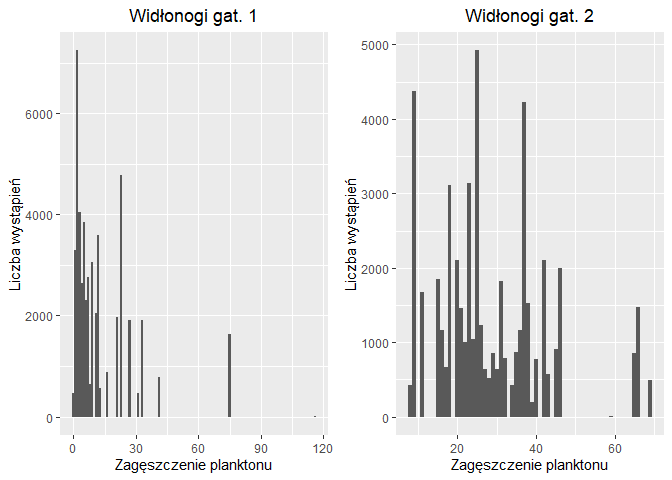<!-- -->

Komentarz: rozklady zbliżone do prawostronnie skośnego. Dla Widłonogów gat. 1 warto usunąć wartości odstające, które prawdopodobnie sa błędnie zebranymi danymi. Poniżej prezentacja porpawionego rozkładu.


```r
lcop1ToRepleace <- which(data$cfin1 > 90)
for (j in lcop1ToRepleace){
  data[i, "lcop1"] <- NA
}
data$lcop1 <- na.interpolation(data$lcop1)
```

```
## Warning: na.interpolation will replaced by na_interpolation.
##            Functionality stays the same.
##            The new function name better fits modern R code style guidelines.
##            Please adjust your code accordingly.
```


```r
p_lcop1 <- ggplot(data, aes(x=lcop1)) +
  geom_histogram(binwidth = 1.0) +
  xlab("Zagęszczenie planktonu") +
  ylab("Liczba wystąpień") + 
  ggtitle("Widłonogi gat. 1") +
  theme(plot.title = element_text(hjust = 0.5))
plot(p_lcop1)
```

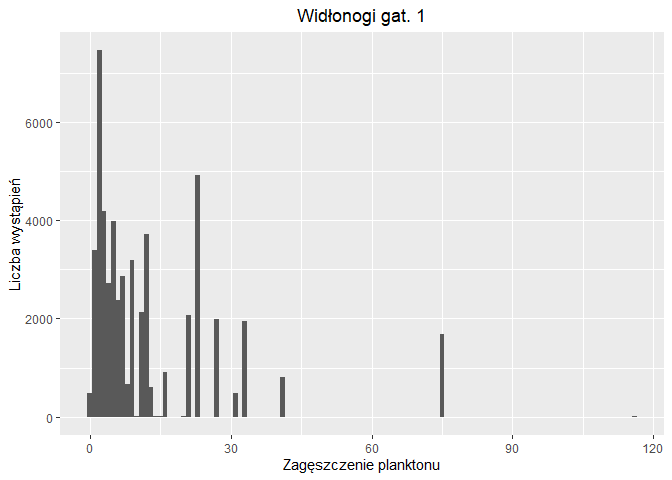<!-- -->

#### Dane dotyczące liczby śledzi


```r
p_fbar <- ggplot(data, aes(fbar)) +
  geom_histogram(binwidth = 0.05) +
  xlab("Ułamek pozostawionego narybku") +
  ylab("Liczba wystąpień") +
  ggtitle("Natężenie połowów w regionie") +
  theme(plot.title = element_text(hjust = 0.5))
p_cumf <- ggplot(data, aes(cumf)) + geom_histogram(binwidth = 0.02) +
  xlab("Ułamek pozostawionego narybku")+
  ylab("Liczba wystąpień") + ggtitle("Łączne roczne natężenie połowów") +
  theme(plot.title = element_text(hjust = 0.5))
grid.arrange(p_fbar, p_cumf, ncol = 2, nrow = 1)
```

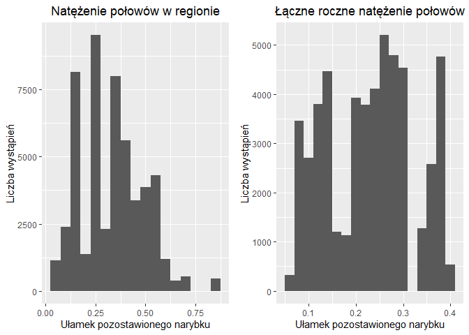<!-- -->

Komentarz: Natężenia połowów mają rozmiat wielomodalny. Nie ma potrzeby zmian.


```r
p_recr <- ggplot(data, aes(recr)) +
  geom_histogram(binwidth = 50000.0) +
  xlab("Liczba śledzi")+
  ylab("Liczba wystąpień") + ggtitle("Roczny narybek") +
  theme(plot.title = element_text(hjust = 0.5))
p_totaln <- ggplot(data, aes(totaln)) + geom_histogram(binwidth = 50000.0) + 
  xlab("Liczba śledzi")+
  ylab("Liczba wystąpień") + ggtitle("Łączna liczba złowionych ryb") +
  theme(plot.title = element_text(hjust = 0.5))
grid.arrange(p_recr, p_cumf, ncol = 2, nrow = 1)
```

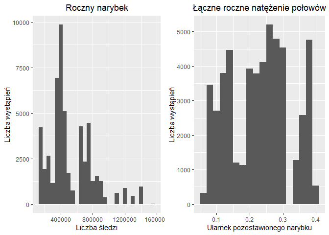<!-- -->

Komentarz: Dane liczby śledzi maja rozklad bardziej równomierny niż dane dotyczące zagęszczenia planktonu. Nie ma potrzeby zmian.

#### Warunki przyrodnicze


```r
p_sst <- ggplot(data, aes(sst)) +
  geom_histogram(binwidth = 0.1) + 
  xlab("Temperatura [°C]") + 
  ylab("Liczba wystąpień") + 
  ggtitle("Temperatura przy powierzchni wody") +
  theme(plot.title = element_text(hjust=0.5))
p_sal <- ggplot(data, aes(sal)) + 
  geom_histogram(binwidth = 0.01) + 
  xlab("Poziom zasolenia [Knudsen ppt]") + 
  ylab("Liczba wystąpień") +
  ggtitle("Zasolenie wody") + 
  theme(plot.title=element_text(hjust=0.5))
p_xmonth <- ggplot(data, aes(xmonth)) +
  geom_histogram(binwidth = 1.0) +
  xlab("Numer miesiąca") +
  ylab("Liczba wystąpień") + 
  ggtitle("Miesiąc połowu") + 
  theme(plot.title=element_text(hjust=0.5))
p_nao <- ggplot(data, aes(nao)) +
  geom_histogram(binwidth = 0.2) +
  xlab("Oscylacja [mb]") + 
  ylab("Liczba wystąpień") +
  ggtitle("Oscylacja północnoatlantycka") +
  theme(plot.title=element_text(hjust=0.5))
grid.arrange(p_sst, p_sal, p_xmonth, p_nao, ncol = 2, nrow = 2)
```

```
## Warning: Removed 1584 rows containing non-finite values (stat_bin).
```

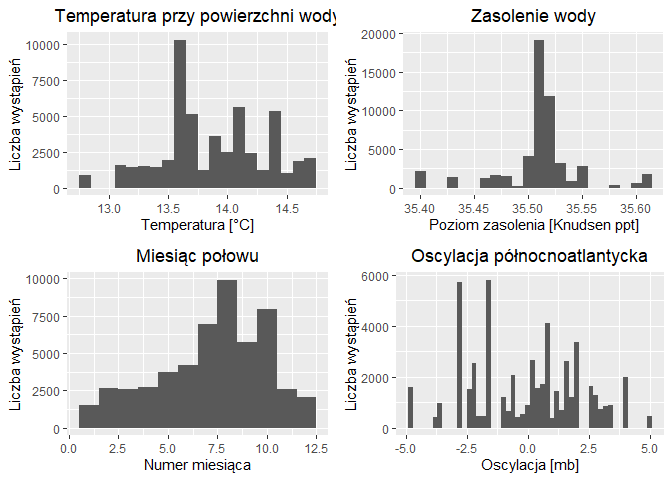<!-- -->

Komentarz: 
- Najczęściej odnotowaną temperaturą wody było 13.6° oraz głównie temperatury wyższe, zapewne przez główne zbieranie danych w okresie letnim.
- Zasolenie wody koncentruje się głównie w przedziale 35.5 - 35.55 oraz zawiera dużo wartości skrajnych, prawdopodobnie z powodu dopływu rzek

Wniosek: Zbiór ma dużo wartości odstających, ale grafiki rozkładów wyraźnie wskazują, że ich usunięcie jest zbyt ryzykowne i nie ma ku temu wskazań. Zostały więc usunięte prawie nic nie znaczące, drobne odstępstwa, wyraźnie wskazujące na błędy pomiarowe.

### Oczyszczenie braków 


```r
completeRowsVector <- complete.cases(data)
completeRows <- data[completeRowsVector, ]
completeRowsCount <- nrow(completeRows)
allRowsCount <- nrow(data)
percentOfCompleteRows <- round(completeRowsCount/allRowsCount * 100, 2)
percentOfIncompleteRows <- 100.0 - percentOfCompleteRows
```

Zbiór zawiera 45223 kompletnych wierszy ze 52582 wszystkich, co stanowi 86%. Więc 14% to dane niekompletne, co stanowi dość dużą wartość. Uzupełnione zostaną średnią wartością danej kolumny zbioru.


```r
for(i in 1:ncol(data)){
  data[is.na(data[,i]), i] <- mean(data[,i], na.rm = TRUE)
}
```


```r
completeRowsVector <- complete.cases(data)
completeRows <- data[completeRowsVector, ]
completeRowsCount <- nrow(completeRows)
allRowsCount <- nrow(data)
percentOfCompleteRows <- round(completeRowsCount/allRowsCount * 100, 2)
```

Zbiór zawiera teraz 100% kompletnych wierszy.

## Analiza

### Macierz korelacji

Poniżej przedstawiono macierz korelacji.


```r
corrplot(cor(data), tl.col="black")
```

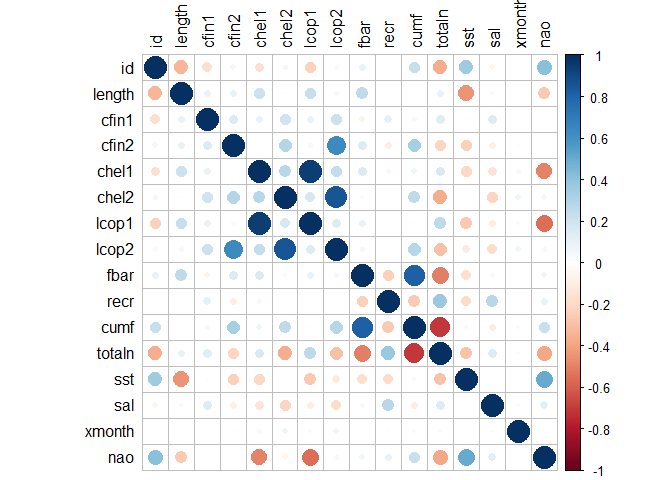<!-- -->

Komentarz: żaden z atrybutów nie wykazuje wysokiego współczynnika korelacji w stosunku do atrybutu decyzyjnego length. Najwyższa pozytywna korelacja występuje dla następujących par:
- 'zagęszczenie widłonogów gat. 1 (lcop1)' oraz 'zagęszczenie Calanus helgolandicus gat. 1 (chel1)',
- 'zagęszczenie widłonogów gat. 2 (lcop2)' oraz 'zagęszczenie Calanus helgolandicus gat. 2 (chel2) '
- 'łączne roczne natężenie połowów w regionie (cumf)' oraz 'natężenie połowów w regionie (fbar)'.
Najwyższa negatywna korelacja występuje dla pary 'łączna liczba ryb złowionych w ramach połowu (totaln)' oraz 'łączne roczne natężenie połowów w regionie (cumf)'.

Szczegółowa prezentacja korelacji 


```r
p_lcop1_chel1 <- ggplot(data, aes(x=lcop1, y=chel1)) + 
  geom_point() + geom_smooth(method=lm) + 
  annotate("text", x = 30, y = 87.25, label = c(paste("wsp. korelacji =", round(cor(data$lcop1, data$chel1),2))))
p_lcop2_chel2 <- ggplot(data, aes(x=lcop2, y=chel2)) + 
  geom_point() + geom_smooth(method=lm) +
  annotate("text", x = 25, y = 50, label = c(paste("wsp. korelacji =", round(cor(data$lcop2, data$chel2),2))))
p_cumf_fbar   <- ggplot(data, aes(x=cumf, y=fbar)) + 
  geom_point() + 
  geom_smooth(method=lm) + annotate("text", x = 0.15, y = 0.7, label = c(paste("wsp. korelacji =", round(cor(data$cumf, data$fbar),2))))
p_totaln_cumf <- ggplot(data, aes(x=totaln, y=cumf)) + 
  geom_point() +
  geom_smooth(method=lm) + annotate("text", x = 800000, y = 0.34,
  label = c(paste("wsp. korelacji =", round(cor(data$totaln, data$cumf),2))))
grid.arrange(p_lcop1_chel1 , p_lcop2_chel2, p_cumf_fbar, p_totaln_cumf, ncol = 2, nrow = 2, top="Wykresy korelacji")
```

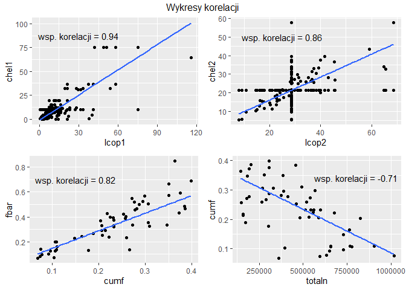<!-- -->

Potwierdzono w ten sposób wysoka korelację pomiędzy tymi parami.

### Zmiana w czasie


```r
data_sample <- sample_n(data, 500)
q <- ggplot(data_sample, aes(id, length)) + 
  geom_jitter() + 
  geom_smooth(se = FALSE, color="green") + 
  geom_vline(xintercept = 17000, colour="darkgray", linetype = "longdash", size=1) + 
  ggtitle('Zmiana długości złowionego śledzia') +
  theme_bw()
ggplotly(q)
```

```
## `geom_smooth()` using method = 'loess' and formula 'y ~ x'
```

<!--html_preserve--><div id="htmlwidget-bbade0b4ecb153bd755c" style="width:672px;height:480px;" class="plotly html-widget"></div>
<script type="application/json" data-for="htmlwidget-bbade0b4ecb153bd755c">{"x":{"data":[{"x":[16129.9964414848,5987.98411586415,716.272094754875,50095.0846098039,2690.88078646176,37111.1911070727,23888.1035976922,38761.2099348152,44598.3601290731,35843.8122067459,34608.2802565115,40631.0304852854,30238.7058099583,41518.1749759797,26554.9793805351,7030.82343826555,3405.1649881795,5492.12394604981,15069.6968440048,39620.1099950224,21568.8443712292,44604.7842174923,26071.1014434824,29754.6526035802,22346.9008593921,6364.77010393348,37556.7344133003,41078.2155169871,29709.8973690417,5600.61997637581,28173.106383563,19320.1445330154,10526.3384128826,30403.6107025927,42572.9227584211,29515.6010744452,27775.8666712843,38760.2702903176,27037.7031137509,21114.9411447709,39562.3039214322,40787.1141927764,151.799105797149,8337.67200247496,45876.2213126974,6084.11683761943,30809.7948912654,12250.0537607796,29741.1708851248,8803.65222889371,37688.2079270968,1090.35599194635,4421.12976441924,11433.375912682,37267.2542964777,13210.9396920472,7831.622318043,46694.2714836093,43361.9884542121,44765.3111345893,21899.694624472,38885.3544191597,27083.6050656717,47156.0903847177,50997.8125467207,38829.8322943693,17361.7902540475,128.658263479359,31339.7998350836,24870.3524247132,1746.64037738983,52181.8985786406,40034.2720468907,28835.6767640736,1898.06314966027,39275.0567864455,22095.8020008506,38596.2990732303,45624.6182599032,22150.9255186589,714.116206934303,5694.60567766558,34189.8227623139,32327.9476514429,4055.37287911624,50813.6662823811,42569.3529024102,25004.2304759812,16349.9046586785,20832.340544121,50274.9644846754,12696.8429831659,22735.9650015619,14990.196092695,1986.95136623196,22685.6230766561,36153.9504413946,5434.60024651531,49071.7068335719,25465.807634156,743.694101784006,30190.2893655952,43227.7626245279,12518.3476283139,44484.253287,2713.02666943688,35894.2927113531,31029.0142579811,44292.8276401449,47342.9583508121,1550.24528209902,45160.0839014255,22920.2262580376,14255.8014171701,6264.17935678177,48327.7525321737,28163.6708309554,17.3051561396569,3512.92289917655,49558.3771730434,37106.7065533495,12406.1113479454,1833.66907621007,32404.2446188351,5858.70402825139,31971.0061092898,8700.81383445859,39022.0661727063,51918.1660854546,2287.14205268491,34376.1419160357,29744.8371845035,48181.6586831633,49799.7497137193,6805.30983062703,25884.2765907237,7267.95300910212,16511.9621486923,4917.01409747731,22689.1140451375,35738.0457010847,36922.6680949762,49261.8205564927,36418.1231317632,2273.04542042073,3888.23186502643,4714.73467443492,26789.240076375,30051.0121723378,513.398424999788,26266.9033987565,45425.2128286133,1484.14316370487,34494.3159612527,33423.1602072595,22152.2871138018,32921.2023502208,42510.7741322329,21844.2760313457,47027.7975264266,5509.21415039208,9615.94367659669,51153.6263636032,45802.1579114849,36208.0444938751,9915.70798272118,36303.2927901754,341.335839745961,33229.7746096956,6628.837826325,48608.2791562421,5818.84138472956,39085.2643256698,11805.9839749336,15063.813356897,47230.8931240495,51824.6874638233,32081.9833445325,41317.1673473753,28465.78526929,20538.9576279925,18771.2853242774,25504.9921792816,52320.7893356366,23810.8332401341,52152.8175011862,47983.7073993968,37235.6037929513,15122.3781297369,35224.7425440282,51956.8658832615,29157.3832764495,23121.3493709255,3224.75631130915,34179.2081829155,31947.9134370472,51476.6677677644,10567.75874574,6697.89260554779,7580.30278514512,42268.2001882562,8155.64714576174,7801.686438209,29501.384895107,19762.3261835447,10703.3170373099,6341.3488835711,39932.1625522083,49342.7761901012,32644.1722254362,12408.2549810305,48667.8753044134,5647.95003236439,36215.7981770568,21484.7580924766,47473.6584337955,42106.7242479635,35459.2253774345,48372.9008693844,22686.8331658484,29903.8742541576,14914.3185220903,38732.1615081906,51866.8960217437,31262.6235917483,50501.9741338277,50866.6559746549,50798.6971844479,48035.1769223412,16837.0152169148,5137.16256163009,28558.6402645707,16860.0627127822,28690.1591534939,25143.109518224,29544.8062976032,17647.6981859334,4294.75228917208,17394.8804610584,47845.30975639,33623.9099361002,49128.0240610406,42938.384505396,23086.2417853381,42810.9017728362,6702.26026228033,30782.7383859186,4768.25866738148,4623.01273620054,6291.7470986275,24999.3801216513,12382.2873687591,50906.9208570885,13184.9686182357,4813.21202732716,24803.7586210907,904.232776963897,24783.7429349059,1976.10729819294,52532.7250111487,8506.18982147835,46644.9450274244,1534.72482507639,1256.94789960627,12281.8982026918,15843.1331865499,38320.6298027061,25620.8505522676,20798.8985285401,20459.0088370426,40640.9514845122,30807.1797565188,4261.36014546826,33983.1743082099,24850.399642176,2590.31828360129,31397.3698942341,7351.38465751689,46292.827189865,46803.7950289279,7696.71369810719,5515.71271422412,51644.9194138294,446.787845931947,13503.2671354426,37618.7599471044,22836.2384406922,34457.1486848766,2590.96617647,41624.9433178559,1700.82267464809,20017.3932246955,48669.8913099268,8668.23410508744,32146.6596894188,1503.91392230671,47306.1432877189,37467.3147269456,51005.8202439053,46584.7831135994,25300.7742358271,16166.2601295102,5623.95572486538,10643.8676636435,33944.270075839,48844.0556791248,35744.2270127956,8193.00787578449,4595.33438055813,24015.3859050762,19234.6960988482,1001.99774646088,31293.8392322043,32840.3494117908,41561.6612972818,22693.9151399633,39109.272156333,35911.0903516823,45719.9980766118,15592.1610003959,51052.9201261131,30841.7000971263,14103.2475325519,19100.0987161133,18395.3774934396,50366.2492772914,32389.7165212184,44723.7240029909,3119.17428457998,20548.1570220094,22072.0944796734,44622.1107575651,14536.6617879353,12089.3486767974,41323.0854121111,35219.2733717274,49511.606208308,12264.8271096362,3309.62196810972,29022.1202837482,17499.181992808,41029.7279871831,39082.8393310456,29359.7010186436,28475.3430181284,26304.3755145622,16645.0283481918,4831.1071957143,28890.6182704782,32513.9028931282,44882.3375548983,687.677819313109,19485.2852383764,49172.1459427048,14545.048399411,39993.7072963109,25334.0090908032,34924.2362188322,43909.2997508971,35771.9259336436,11322.9515522879,13704.338391009,14085.7662984826,31409.3343865972,16093.3491733519,40709.0833677884,7729.2779230928,25204.8216495117,27534.0007928528,37699.9232191568,41437.955429163,13066.1937751355,28272.7744311016,12603.7365899775,37248.2310068633,40753.3860516148,21917.8105400041,12246.7109207112,41674.8605289711,38594.1297796467,44839.0900642807,11211.9373961432,31973.6849684276,43534.1431893893,7328.02531250585,37913.3861861844,24961.0981474373,16808.734741356,46193.3347446205,25974.029846626,49154.1698782956,13872.9340323301,47332.9264423316,25734.9749502594,34208.7224861609,489.14946958553,5586.89829291236,51422.626586652,16603.3941972584,11986.7144462436,8794.92145440597,37373.9817058241,27773.2902885785,43449.3501774518,11095.9672794783,14265.9430320332,15441.8336831296,38499.2847880274,49845.9850268904,31785.7885543207,29849.119933792,33505.3885713354,18248.2152826343,20404.8891932579,12199.2961128628,41333.3551416786,51616.2247022344,1580.95670569241,9943.80417448264,21366.1962931022,5997.26161543466,17208.2269746698,21147.7328637244,35204.8726125458,23523.3158133017,44620.8632191919,19598.3171840735,49717.3666413235,38336.8440834139,46355.1027387945,13017.8609313559,31399.6471676828,25724.6852349434,18015.8372847591,15678.9720916606,5492.90967300721,41138.9808709702,21803.7745552851,49711.0025041334,40817.1022973785,41549.1659595521,17916.8513960116,7364.21833982114,46140.0544506596,31848.7363913339,44523.9851388453,787.965965376236,6115.12543842308,15987.7005454104,22973.7973925522,46749.7826605724,11935.8530316332,51366.9782314798,27123.7749947988,20237.1765900167,43456.9675309619,34615.14885181,20092.1559135919,38779.7834727123,23852.2344161505,6069.26115978751,23824.7777633239,23047.3402976474,27671.6551838903,5494.79032111131,14161.2609006228,6430.76268800441,8039.96491871793,12329.7797255618,43024.6652948027,13559.3315303657,12530.2723980457,41469.7935803428,38375.2599275092,4351.2566666754,40221.041720904,4962.03553739656,46909.2194179378,28166.8633281374,20724.1219012992,2226.83228442166,31548.6010118801,35860.0725027092,19271.8694462445,49165.1494987668,18619.7182496704,51742.8604283385,32615.7514460936,38740.9434091672,17234.9580266135,33579.7688079592,47731.275425362,19110.6039434787,17804.6811670648,45259.9566874549,26815.626761313,9933.13266131002,51971.9998379501,18484.1825528827,46148.3545442991],"y":[28.9856394074112,26.4517121209204,26.0020512051508,24.960538828969,25.0747537235543,25.0077225701511,28.069322444424,26.0754430006072,24.0149731658399,25.0103256045654,25.5181514544412,25.057058580257,27.0484721577913,25.4732799723744,26.5134802138805,22.07852421619,24.9724591673911,24.9905606910586,25.9894561086595,27.9630941158161,23.9562815240026,25.5316175687313,26.4428661690652,26.0001015183702,24.5657522016764,25.4910693337396,25.0154229233786,23.0300010577962,26.427234160006,24.9399339185283,23.9880527918413,25.5356404539198,24.5051577027515,24.9930553158,24.5484195233509,29.0219520328939,25.0671795892343,25.0597694466263,25.4498563717678,26.4245221623778,25.5146363124624,25.5232841414213,24.0481787268817,26.4841054871678,25.4781932632625,25.5386024948582,25.9493133950233,27.5511837137863,26.5782289727777,24.4986780267581,23.9632342522964,24.4403822690621,25.4864382923767,27.0056637467816,24.5319435188174,26.0014295612648,24.4206235547364,22.9489879808947,25.4642422178388,22.50852590736,24.9562065777555,25.5617598515376,25.9863207796961,22.5771139058471,24.0396226291731,24.4733978507668,26.4895898120478,23.4618570365757,25.9535634807125,27.0688539591432,25.9970169201121,26.4657048903778,22.0587107716873,26.0168231401593,26.520625204891,24.4654414248094,26.0711382427812,22.5341861077771,24.0736293870956,25.4504773190245,24.9606331240386,29.535995278731,26.4260577574372,26.9519323480874,24.5464414957911,22.0155483994633,25.4841699687764,25.0016634292528,27.4526314376667,24.4561711800471,24.4487689306587,23.97366830796,26.9913776374236,26.9762529189885,25.4698134969175,26.4802322577685,24.5067068930343,24.9267060723528,22.5065243206546,25.9494629258662,27.938117592372,22.4510397142917,24.452872518301,26.0527500680089,21.5643004382029,30.4294018771127,25.4966479308158,27.0601061965153,22.4715125216916,22.0427516482398,27.0220357862115,24.4719822518528,26.0585701968893,26.4941427408159,24.4952702897415,24.9581471902505,25.5176635957882,23.0412471266463,25.4777295554802,23.0084846159071,24.4912950570136,26.5609574897215,24.4801228761673,25.9909802692756,24.4498538854346,21.5301000939682,23.0743015654385,26.5453236043081,23.4443943032995,20.9803790620342,24.4711607256904,27.5075475683808,24.0185204602033,25.4952478669956,24.0788906098902,27.5622072998807,26.032255778946,27.9823155906051,25.4390267109498,25.5542765591666,24.9491345500946,25.9731231283024,23.4997104199231,23.9276039754227,26.9515965871885,24.5568382249027,24.0522989318147,22.5721354179084,24.9863158864528,22.9528055720404,24.5626276185736,23.0069527121633,24.9661287933215,25.0295076273382,24.0597356883809,25.9984123675898,22.0312248336896,25.5099172109365,22.464567565769,23.9236348728463,25.9363063361123,27.4930571876839,23.4932599254325,23.4783333240449,26.4640295773745,25.490697385557,24.5589133428782,23.0254771459103,24.0536486773193,24.4358361627161,22.4684204441681,25.4903172342107,25.0225274661183,23.9988429335132,25.9338831043988,23.0402806925401,22.4643654542044,25.487717329748,23.4339035186917,23.0391810383275,26.0502620664984,26.0298232912645,27.4272868274152,28.0511375132948,25.9852286478132,24.9677946118265,24.0480246535316,25.9642311602086,26.9418955171853,26.0147010984644,24.4411098538339,26.9579639022052,25.4216231294721,23.0265716062859,26.5598263898492,23.5353453058749,24.53487489447,27.5741357368603,24.4846238567308,23.9835307830572,23.4506977401301,27.0773833194375,22.4563266856596,27.005406188257,26.5069325633347,28.0562299048901,25.9264473093301,22.9971253794059,22.4955748393387,24.5588252297044,24.9728422406316,24.4565120854974,26.4623695480824,25.9637960626185,28.9708283767477,26.4506265576929,24.5060759275034,25.4613814311102,22.50113638293,26.0160834511369,27.010831711255,27.4499346529692,24.4699452288449,19.9877364629135,26.9840687793866,23.035521283336,23.4574848321453,23.4566089135036,23.9978934849054,26.5103847481683,25.518587905094,27.5280234258622,25.4593132544681,24.9732861633226,26.9991746479273,28.4513419818506,26.9759242819995,24.0011561584473,31.0445681630075,22.967264727205,23.5763556117564,20.5417572125792,24.0722833969817,28.5451994332671,24.46458296258,25.9226505791396,25.0588248071447,24.4960283569992,24.5630861974508,25.0689079378918,24.496778967306,26.5142371272668,27.023503508158,26.5744033599645,23.4379146547243,22.4684844151139,24.9869063972309,25.0352308725566,24.4677436996996,25.5308385872096,25.5186105503514,26.5777857742459,27.5704097907245,24.4448023821041,23.5225376005843,29.4649444781989,28.9450695360452,26.511404838413,27.5376146495715,25.9529029481858,24.9711344985291,24.5601798890159,25.0036470860243,23.4873284458369,23.0054015348479,27.5253488474712,26.9793219942972,24.5151953583211,24.464530550763,25.482646853812,26.5389875130728,25.5761299108714,24.0180717077479,21.5602950081229,25.4338135813177,25.5438655670732,26.046959426105,25.0225848458707,26.04059898559,25.9342344525456,28.4316909618303,24.0619161460176,25.4860784199834,24.4418948746473,24.9730219851807,25.5134723173454,22.9838866828755,24.052039967142,24.4267522376776,24.9907667087764,25.9554753378034,27.501649880968,23.4834680926055,26.0758561730385,26.0732426367328,23.5529862467945,24.0254908259585,25.047615130879,25.4540579032153,27.9979702041298,27.4256454894319,25.5047100061178,25.4692935666069,25.0518413879722,23.9744631299749,27.4718209993094,26.5369080711529,25.922897638455,24.4314259836823,26.9674005486816,23.5721007430926,25.0631166943535,27.5261396630481,29.0405866711214,26.9503191369399,25.0714920635149,25.4863672770932,23.5397624209523,22.0088684805855,25.4704038378224,24.0650346363708,26.0316062967479,27.4506849358976,28.9875526228547,22.4453754676878,24.9263747182116,22.5781329155341,25.9629390979558,23.4793850824609,26.4343945196643,25.447687664777,23.5586651314423,20.5647308044508,26.4725175921619,24.9388234687224,28.494230116345,27.5658529963717,26.4827919922024,23.0001482754573,24.5566570313275,23.9767917022854,23.9897352404892,26.9909953213856,22.493849971965,27.9652625784278,22.5286106758192,26.5742400392517,28.4466964818165,24.0518980985507,25.4474829373881,27.9696954312176,25.483610483259,26.4249502823502,25.9760954998061,27.4642986455932,22.9851955280825,24.9559220309928,24.5741025647521,27.4208989188075,23.9206390470266,24.0654289740697,26.9378260109574,26.0198338632658,27.5724275895208,26.016449180916,25.45133045692,24.6897997652367,26.4632600009069,23.5342449108884,22.9213527923822,21.5191713209078,25.9324618256092,23.4541685815155,22.9300067973882,25.56219808992,25.9583053350821,23.5323955907673,25.9206633375585,25.57965191219,27.5616474023089,23.9992169651389,24.9437723051757,25.0210313940793,26.0429905452952,24.9734055547044,24.998765796572,24.0718911852688,24.4421788488701,26.4247839821875,26.5493606553972,26.5768369406462,25.0451974929124,25.0722348479554,23.5517495401204,24.9281753152981,26.4602566218749,28.0795853570849,24.0306231120974,23.0763241509348,25.5575853801146,25.0610011069849,23.0670433286205,27.5655759591237,24.9221894355863,25.9754580203444,24.4433733480051,23.9858297588304,26.0618407803774,26.0764394247532,29.5384107171744,25.5618965493888,26.4735405379906,25.0146479231492,25.5611468515545,25.423466093801,25.5413408299536,25.9534359288588,24.5542358639464,24.5138083345816,25.5167054375261,28.0414657460526,24.4794488581643,27.4293225408345,28.0561949411035,26.0711569839343,23.0421655322239,23.9325839132071,24.0416777078807,23.5541405106336,25.5181686520576,23.9659637162089,25.0149451947957,24.5276527155563,24.0052227355912,25.9718459253013,23.4218028347939,20.9706498739123,25.079314535819,25.5329578126222,28.0209445156902,22.9692950405926,24.0691814832017,24.5733937355503,23.5291985891014,26.4692928244174,23.9705738064274,24.9400680437684,26.4526458425447,24.071107128486,27.0298495069146,27.065735675022,27.059256121926,29.0633309426904,26.4653864539042,23.0076035097614,26.9839452377334,25.4637526959553,26.4526235985756,28.057660249956,23.953467974402,24.4450567653775,27.539491109848,21.9915712429211,24.5700332329795,26.5515480805561,25.5321063005924,26.9630032553151,24.5208759083226,27.4365782496333,24.0220941845328,25.4203556574881,24.5699441352859,26.5099030544236,27.5056371624023,23.9326438166946,26.9264559872821,23.5284970327467,24.9253837559372,24.4884450162947,25.4490238939598,22.9648778636381,25.072816462405,29.5355524796247,27.0315829046816,23.5547616817057,26.5038957498968,26.5316382016987,25.9238764551654,27.5393490046635,23.4519798478857],"text":["id: 16130<br />length: 29.0","id:  5988<br />length: 26.5","id:   716<br />length: 26.0","id: 50095<br />length: 25.0","id:  2691<br />length: 25.0","id: 37111<br />length: 25.0","id: 23888<br />length: 28.0","id: 38761<br />length: 26.0","id: 44598<br />length: 24.0","id: 35844<br />length: 25.0","id: 34608<br />length: 25.5","id: 40631<br />length: 25.0","id: 30239<br />length: 27.0","id: 41518<br />length: 25.5","id: 26555<br />length: 26.5","id:  7031<br />length: 22.0","id:  3405<br />length: 25.0","id:  5492<br />length: 25.0","id: 15070<br />length: 26.0","id: 39620<br />length: 28.0","id: 21569<br />length: 24.0","id: 44605<br />length: 25.5","id: 26071<br />length: 26.5","id: 29755<br />length: 26.0","id: 22347<br />length: 24.5","id:  6365<br />length: 25.5","id: 37557<br />length: 25.0","id: 41078<br />length: 23.0","id: 29710<br />length: 26.5","id:  5601<br />length: 25.0","id: 28173<br />length: 24.0","id: 19320<br />length: 25.5","id: 10526<br />length: 24.5","id: 30404<br />length: 25.0","id: 42573<br />length: 24.5","id: 29516<br />length: 29.0","id: 27776<br />length: 25.0","id: 38760<br />length: 25.0","id: 27038<br />length: 25.5","id: 21115<br />length: 26.5","id: 39562<br />length: 25.5","id: 40787<br />length: 25.5","id:   152<br />length: 24.0","id:  8338<br />length: 26.5","id: 45876<br />length: 25.5","id:  6084<br />length: 25.5","id: 30810<br />length: 26.0","id: 12250<br />length: 27.5","id: 29741<br />length: 26.5","id:  8804<br />length: 24.5","id: 37688<br />length: 24.0","id:  1090<br />length: 24.5","id:  4421<br />length: 25.5","id: 11433<br />length: 27.0","id: 37267<br />length: 24.5","id: 13211<br />length: 26.0","id:  7832<br />length: 24.5","id: 46694<br />length: 23.0","id: 43362<br />length: 25.5","id: 44765<br />length: 22.5","id: 21900<br />length: 25.0","id: 38885<br />length: 25.5","id: 27084<br />length: 26.0","id: 47156<br />length: 22.5","id: 50998<br />length: 24.0","id: 38830<br />length: 24.5","id: 17362<br />length: 26.5","id:   129<br />length: 23.5","id: 31340<br />length: 26.0","id: 24870<br />length: 27.0","id:  1747<br />length: 26.0","id: 52182<br />length: 26.5","id: 40034<br />length: 22.0","id: 28836<br />length: 26.0","id:  1898<br />length: 26.5","id: 39275<br />length: 24.5","id: 22096<br />length: 26.0","id: 38596<br />length: 22.5","id: 45625<br />length: 24.0","id: 22151<br />length: 25.5","id:   714<br />length: 25.0","id:  5695<br />length: 29.5","id: 34190<br />length: 26.5","id: 32328<br />length: 27.0","id:  4055<br />length: 24.5","id: 50814<br />length: 22.0","id: 42569<br />length: 25.5","id: 25004<br />length: 25.0","id: 16350<br />length: 27.5","id: 20832<br />length: 24.5","id: 50275<br />length: 24.5","id: 12697<br />length: 24.0","id: 22736<br />length: 27.0","id: 14990<br />length: 27.0","id:  1987<br />length: 25.5","id: 22686<br />length: 26.5","id: 36154<br />length: 24.5","id:  5435<br />length: 25.0","id: 49072<br />length: 22.5","id: 25466<br />length: 26.0","id:   744<br />length: 28.0","id: 30190<br />length: 22.5","id: 43228<br />length: 24.5","id: 12518<br />length: 26.0","id: 44484<br />length: 21.5","id:  2713<br />length: 30.5","id: 35894<br />length: 25.5","id: 31029<br />length: 27.0","id: 44293<br />length: 22.5","id: 47343<br />length: 22.0","id:  1550<br />length: 27.0","id: 45160<br />length: 24.5","id: 22920<br />length: 26.0","id: 14256<br />length: 26.5","id:  6264<br />length: 24.5","id: 48328<br />length: 25.0","id: 28164<br />length: 25.5","id:    17<br />length: 23.0","id:  3513<br />length: 25.5","id: 49558<br />length: 23.0","id: 37107<br />length: 24.5","id: 12406<br />length: 26.5","id:  1834<br />length: 24.5","id: 32404<br />length: 26.0","id:  5859<br />length: 24.5","id: 31971<br />length: 21.5","id:  8701<br />length: 23.0","id: 39022<br />length: 26.5","id: 51918<br />length: 23.5","id:  2287<br />length: 21.0","id: 34376<br />length: 24.5","id: 29745<br />length: 27.5","id: 48182<br />length: 24.0","id: 49800<br />length: 25.5","id:  6805<br />length: 24.0","id: 25884<br />length: 27.5","id:  7268<br />length: 26.0","id: 16512<br />length: 28.0","id:  4917<br />length: 25.5","id: 22689<br />length: 25.5","id: 35738<br />length: 25.0","id: 36923<br />length: 26.0","id: 49262<br />length: 23.5","id: 36418<br />length: 24.0","id:  2273<br />length: 27.0","id:  3888<br />length: 24.5","id:  4715<br />length: 24.0","id: 26789<br />length: 22.5","id: 30051<br />length: 25.0","id:   513<br />length: 23.0","id: 26267<br />length: 24.5","id: 45425<br />length: 23.0","id:  1484<br />length: 25.0","id: 34494<br />length: 25.0","id: 33423<br />length: 24.0","id: 22152<br />length: 26.0","id: 32921<br />length: 22.0","id: 42511<br />length: 25.5","id: 21844<br />length: 22.5","id: 47028<br />length: 24.0","id:  5509<br />length: 26.0","id:  9616<br />length: 27.5","id: 51154<br />length: 23.5","id: 45802<br />length: 23.5","id: 36208<br />length: 26.5","id:  9916<br />length: 25.5","id: 36303<br />length: 24.5","id:   341<br />length: 23.0","id: 33230<br />length: 24.0","id:  6629<br />length: 24.5","id: 48608<br />length: 22.5","id:  5819<br />length: 25.5","id: 39085<br />length: 25.0","id: 11806<br />length: 24.0","id: 15064<br />length: 26.0","id: 47231<br />length: 23.0","id: 51825<br />length: 22.5","id: 32082<br />length: 25.5","id: 41317<br />length: 23.5","id: 28466<br />length: 23.0","id: 20539<br />length: 26.0","id: 18771<br />length: 26.0","id: 25505<br />length: 27.5","id: 52321<br />length: 28.0","id: 23811<br />length: 26.0","id: 52153<br />length: 25.0","id: 47984<br />length: 24.0","id: 37236<br />length: 26.0","id: 15122<br />length: 27.0","id: 35225<br />length: 26.0","id: 51957<br />length: 24.5","id: 29157<br />length: 27.0","id: 23121<br />length: 25.5","id:  3225<br />length: 23.0","id: 34179<br />length: 26.5","id: 31948<br />length: 23.5","id: 51477<br />length: 24.5","id: 10568<br />length: 27.5","id:  6698<br />length: 24.5","id:  7580<br />length: 24.0","id: 42268<br />length: 23.5","id:  8156<br />length: 27.0","id:  7802<br />length: 22.5","id: 29501<br />length: 27.0","id: 19762<br />length: 26.5","id: 10703<br />length: 28.0","id:  6341<br />length: 26.0","id: 39932<br />length: 23.0","id: 49343<br />length: 22.5","id: 32644<br />length: 24.5","id: 12408<br />length: 25.0","id: 48668<br />length: 24.5","id:  5648<br />length: 26.5","id: 36216<br />length: 26.0","id: 21485<br />length: 29.0","id: 47474<br />length: 26.5","id: 42107<br />length: 24.5","id: 35459<br />length: 25.5","id: 48373<br />length: 22.5","id: 22687<br />length: 26.0","id: 29904<br />length: 27.0","id: 14914<br />length: 27.5","id: 38732<br />length: 24.5","id: 51867<br />length: 20.0","id: 31263<br />length: 27.0","id: 50502<br />length: 23.0","id: 50867<br />length: 23.5","id: 50799<br />length: 23.5","id: 48035<br />length: 24.0","id: 16837<br />length: 26.5","id:  5137<br />length: 25.5","id: 28559<br />length: 27.5","id: 16860<br />length: 25.5","id: 28690<br />length: 25.0","id: 25143<br />length: 27.0","id: 29545<br />length: 28.5","id: 17648<br />length: 27.0","id:  4295<br />length: 24.0","id: 17395<br />length: 31.0","id: 47845<br />length: 23.0","id: 33624<br />length: 23.5","id: 49128<br />length: 20.5","id: 42938<br />length: 24.0","id: 23086<br />length: 28.5","id: 42811<br />length: 24.5","id:  6702<br />length: 26.0","id: 30783<br />length: 25.0","id:  4768<br />length: 24.5","id:  4623<br />length: 24.5","id:  6292<br />length: 25.0","id: 24999<br />length: 24.5","id: 12382<br />length: 26.5","id: 50907<br />length: 27.0","id: 13185<br />length: 26.5","id:  4813<br />length: 23.5","id: 24804<br />length: 22.5","id:   904<br />length: 25.0","id: 24784<br />length: 25.0","id:  1976<br />length: 24.5","id: 52533<br />length: 25.5","id:  8506<br />length: 25.5","id: 46645<br />length: 26.5","id:  1535<br />length: 27.5","id:  1257<br />length: 24.5","id: 12282<br />length: 23.5","id: 15843<br />length: 29.5","id: 38321<br />length: 29.0","id: 25621<br />length: 26.5","id: 20799<br />length: 27.5","id: 20459<br />length: 26.0","id: 40641<br />length: 25.0","id: 30807<br />length: 24.5","id:  4261<br />length: 25.0","id: 33983<br />length: 23.5","id: 24850<br />length: 23.0","id:  2590<br />length: 27.5","id: 31397<br />length: 27.0","id:  7351<br />length: 24.5","id: 46293<br />length: 24.5","id: 46804<br />length: 25.5","id:  7697<br />length: 26.5","id:  5516<br />length: 25.5","id: 51645<br />length: 24.0","id:   447<br />length: 21.5","id: 13503<br />length: 25.5","id: 37619<br />length: 25.5","id: 22836<br />length: 26.0","id: 34457<br />length: 25.0","id:  2591<br />length: 26.0","id: 41625<br />length: 26.0","id:  1701<br />length: 28.5","id: 20017<br />length: 24.0","id: 48670<br />length: 25.5","id:  8668<br />length: 24.5","id: 32147<br />length: 25.0","id:  1504<br />length: 25.5","id: 47306<br />length: 23.0","id: 37467<br />length: 24.0","id: 51006<br />length: 24.5","id: 46585<br />length: 25.0","id: 25301<br />length: 26.0","id: 16166<br />length: 27.5","id:  5624<br />length: 23.5","id: 10644<br />length: 26.0","id: 33944<br />length: 26.0","id: 48844<br />length: 23.5","id: 35744<br />length: 24.0","id:  8193<br />length: 25.0","id:  4595<br />length: 25.5","id: 24015<br />length: 28.0","id: 19235<br />length: 27.5","id:  1002<br />length: 25.5","id: 31294<br />length: 25.5","id: 32840<br />length: 25.0","id: 41562<br />length: 24.0","id: 22694<br />length: 27.5","id: 39109<br />length: 26.5","id: 35911<br />length: 26.0","id: 45720<br />length: 24.5","id: 15592<br />length: 27.0","id: 51053<br />length: 23.5","id: 30842<br />length: 25.0","id: 14103<br />length: 27.5","id: 19100<br />length: 29.0","id: 18395<br />length: 27.0","id: 50366<br />length: 25.0","id: 32390<br />length: 25.5","id: 44724<br />length: 23.5","id:  3119<br />length: 22.0","id: 20548<br />length: 25.5","id: 22072<br />length: 24.0","id: 44622<br />length: 26.0","id: 14537<br />length: 27.5","id: 12089<br />length: 29.0","id: 41323<br />length: 22.5","id: 35219<br />length: 25.0","id: 49512<br />length: 22.5","id: 12265<br />length: 26.0","id:  3310<br />length: 23.5","id: 29022<br />length: 26.5","id: 17499<br />length: 25.5","id: 41030<br />length: 23.5","id: 39083<br />length: 20.5","id: 29360<br />length: 26.5","id: 28475<br />length: 25.0","id: 26304<br />length: 28.5","id: 16645<br />length: 27.5","id:  4831<br />length: 26.5","id: 28891<br />length: 23.0","id: 32514<br />length: 24.5","id: 44882<br />length: 24.0","id:   688<br />length: 24.0","id: 19485<br />length: 27.0","id: 49172<br />length: 22.5","id: 14545<br />length: 28.0","id: 39994<br />length: 22.5","id: 25334<br />length: 26.5","id: 34924<br />length: 28.5","id: 43909<br />length: 24.0","id: 35772<br />length: 25.5","id: 11323<br />length: 28.0","id: 13704<br />length: 25.5","id: 14086<br />length: 26.5","id: 31409<br />length: 26.0","id: 16093<br />length: 27.5","id: 40709<br />length: 23.0","id:  7729<br />length: 25.0","id: 25205<br />length: 24.5","id: 27534<br />length: 27.5","id: 37700<br />length: 24.0","id: 41438<br />length: 24.0","id: 13066<br />length: 27.0","id: 28273<br />length: 26.0","id: 12604<br />length: 27.5","id: 37248<br />length: 26.0","id: 40753<br />length: 25.5","id: 21918<br />length: 24.7","id: 12247<br />length: 26.5","id: 41675<br />length: 23.5","id: 38594<br />length: 23.0","id: 44839<br />length: 21.5","id: 11212<br />length: 26.0","id: 31974<br />length: 23.5","id: 43534<br />length: 23.0","id:  7328<br />length: 25.5","id: 37913<br />length: 26.0","id: 24961<br />length: 23.5","id: 16809<br />length: 26.0","id: 46193<br />length: 25.5","id: 25974<br />length: 27.5","id: 49154<br />length: 24.0","id: 13873<br />length: 25.0","id: 47333<br />length: 25.0","id: 25735<br />length: 26.0","id: 34209<br />length: 25.0","id:   489<br />length: 25.0","id:  5587<br />length: 24.0","id: 51423<br />length: 24.5","id: 16603<br />length: 26.5","id: 11987<br />length: 26.5","id:  8795<br />length: 26.5","id: 37374<br />length: 25.0","id: 27773<br />length: 25.0","id: 43449<br />length: 23.5","id: 11096<br />length: 25.0","id: 14266<br />length: 26.5","id: 15442<br />length: 28.0","id: 38499<br />length: 24.0","id: 49846<br />length: 23.0","id: 31786<br />length: 25.5","id: 29849<br />length: 25.0","id: 33505<br />length: 23.0","id: 18248<br />length: 27.5","id: 20405<br />length: 25.0","id: 12199<br />length: 26.0","id: 41333<br />length: 24.5","id: 51616<br />length: 24.0","id:  1581<br />length: 26.0","id:  9944<br />length: 26.0","id: 21366<br />length: 29.5","id:  5997<br />length: 25.5","id: 17208<br />length: 26.5","id: 21148<br />length: 25.0","id: 35205<br />length: 25.5","id: 23523<br />length: 25.5","id: 44621<br />length: 25.5","id: 19598<br />length: 26.0","id: 49717<br />length: 24.5","id: 38337<br />length: 24.5","id: 46355<br />length: 25.5","id: 13018<br />length: 28.0","id: 31400<br />length: 24.5","id: 25725<br />length: 27.5","id: 18016<br />length: 28.0","id: 15679<br />length: 26.0","id:  5493<br />length: 23.0","id: 41139<br />length: 24.0","id: 21804<br />length: 24.0","id: 49711<br />length: 23.5","id: 40817<br />length: 25.5","id: 41549<br />length: 24.0","id: 17917<br />length: 25.0","id:  7364<br />length: 24.5","id: 46140<br />length: 24.0","id: 31849<br />length: 26.0","id: 44524<br />length: 23.5","id:   788<br />length: 21.0","id:  6115<br />length: 25.0","id: 15988<br />length: 25.5","id: 22974<br />length: 28.0","id: 46750<br />length: 23.0","id: 11936<br />length: 24.0","id: 51367<br />length: 24.5","id: 27124<br />length: 23.5","id: 20237<br />length: 26.5","id: 43457<br />length: 24.0","id: 34615<br />length: 25.0","id: 20092<br />length: 26.5","id: 38780<br />length: 24.0","id: 23852<br />length: 27.0","id:  6069<br />length: 27.0","id: 23825<br />length: 27.0","id: 23047<br />length: 29.0","id: 27672<br />length: 26.5","id:  5495<br />length: 23.0","id: 14161<br />length: 27.0","id:  6431<br />length: 25.5","id:  8040<br />length: 26.5","id: 12330<br />length: 28.0","id: 43025<br />length: 24.0","id: 13559<br />length: 24.5","id: 12530<br />length: 27.5","id: 41470<br />length: 22.0","id: 38375<br />length: 24.5","id:  4351<br />length: 26.5","id: 40221<br />length: 25.5","id:  4962<br />length: 27.0","id: 46909<br />length: 24.5","id: 28167<br />length: 27.5","id: 20724<br />length: 24.0","id:  2227<br />length: 25.5","id: 31549<br />length: 24.5","id: 35860<br />length: 26.5","id: 19272<br />length: 27.5","id: 49165<br />length: 24.0","id: 18620<br />length: 27.0","id: 51743<br />length: 23.5","id: 32616<br />length: 25.0","id: 38741<br />length: 24.5","id: 17235<br />length: 25.5","id: 33580<br />length: 23.0","id: 47731<br />length: 25.0","id: 19111<br />length: 29.5","id: 17805<br />length: 27.0","id: 45260<br />length: 23.5","id: 26816<br />length: 26.5","id:  9933<br />length: 26.5","id: 51972<br />length: 26.0","id: 18484<br />length: 27.5","id: 46148<br />length: 23.5"],"type":"scatter","mode":"markers","marker":{"autocolorscale":false,"color":"rgba(0,0,0,1)","opacity":1,"size":5.66929133858268,"symbol":"circle","line":{"width":1.88976377952756,"color":"rgba(0,0,0,1)"}},"hoveron":"points","showlegend":false,"xaxis":"x","yaxis":"y","hoverinfo":"text","frame":null},{"x":[17,681.759493670886,1346.51898734177,2011.27848101266,2676.03797468354,3340.79746835443,4005.55696202532,4670.3164556962,5335.07594936709,5999.83544303797,6664.59493670886,7329.35443037975,7994.11392405063,8658.87341772152,9323.6329113924,9988.39240506329,10653.1518987342,11317.9113924051,11982.6708860759,12647.4303797468,13312.1898734177,13976.9493670886,14641.7088607595,15306.4683544304,15971.2278481013,16635.9873417722,17300.746835443,17965.5063291139,18630.2658227848,19295.0253164557,19959.7848101266,20624.5443037975,21289.3037974684,21954.0632911392,22618.8227848101,23283.582278481,23948.3417721519,24613.1012658228,25277.8607594937,25942.6202531646,26607.3797468354,27272.1392405063,27936.8987341772,28601.6582278481,29266.417721519,29931.1772151899,30595.9367088608,31260.6962025316,31925.4556962025,32590.2151898734,33254.9746835443,33919.7341772152,34584.4936708861,35249.253164557,35914.0126582278,36578.7721518987,37243.5316455696,37908.2911392405,38573.0506329114,39237.8101265823,39902.5696202532,40567.329113924,41232.0886075949,41896.8481012658,42561.6075949367,43226.3670886076,43891.1265822785,44555.8860759494,45220.6455696203,45885.4050632911,46550.164556962,47214.9240506329,47879.6835443038,48544.4430379747,49209.2025316456,49873.9620253165,50538.7215189873,51203.4810126582,51868.2405063291,52533],"y":[24.3325794148483,24.4841368352988,24.6301841976832,24.7707183142803,24.905735997369,25.0352340592282,25.1592093121366,25.2776585683732,25.3905786402169,25.4979125096269,25.5994268829676,25.6951367169331,25.7850904047612,25.8693363396894,25.9479229149554,26.0208985237967,26.088311559451,26.1502104151559,26.206643484149,26.2577746014485,26.3048278763671,26.3478403403405,26.3864572208801,26.420323745497,26.4490851417028,26.4723866370087,26.4898734589261,26.5011908349664,26.5059839926408,26.5038981594607,26.4945785629375,26.474126288599,26.4367673569436,26.3853516107417,26.3229700659815,26.2527137386509,26.1776736447379,26.1009408002306,26.0256062211169,25.9547609233849,25.8914959230226,25.8342607866023,25.7728106364955,25.7074754830778,25.6392147174913,25.568987730878,25.4977539143801,25.4264726591395,25.3561033562985,25.287605396999,25.2219381723832,25.1577759744615,25.090529972372,25.0210734251798,24.9505429396378,24.8800751224991,24.8108065805163,24.7438739204425,24.6804137490305,24.6215626730332,24.5676985505704,24.5152481794873,24.4637170914901,24.4132593927871,24.3640291895867,24.3161805880973,24.2698676945271,24.2252446150847,24.1824654559783,24.1416843234163,24.1030553236071,24.0667108548673,24.0326134739215,24.0006483732561,23.9707004332023,23.9426545340911,23.9163955562538,23.8918083800215,23.8687778857255,23.847188953697],"text":["id:    17.0000<br />length: 24.33258","id:   681.7595<br />length: 24.48414","id:  1346.5190<br />length: 24.63018","id:  2011.2785<br />length: 24.77072","id:  2676.0380<br />length: 24.90574","id:  3340.7975<br />length: 25.03523","id:  4005.5570<br />length: 25.15921","id:  4670.3165<br />length: 25.27766","id:  5335.0759<br />length: 25.39058","id:  5999.8354<br />length: 25.49791","id:  6664.5949<br />length: 25.59943","id:  7329.3544<br />length: 25.69514","id:  7994.1139<br />length: 25.78509","id:  8658.8734<br />length: 25.86934","id:  9323.6329<br />length: 25.94792","id:  9988.3924<br />length: 26.02090","id: 10653.1519<br />length: 26.08831","id: 11317.9114<br />length: 26.15021","id: 11982.6709<br />length: 26.20664","id: 12647.4304<br />length: 26.25777","id: 13312.1899<br />length: 26.30483","id: 13976.9494<br />length: 26.34784","id: 14641.7089<br />length: 26.38646","id: 15306.4684<br />length: 26.42032","id: 15971.2278<br />length: 26.44909","id: 16635.9873<br />length: 26.47239","id: 17300.7468<br />length: 26.48987","id: 17965.5063<br />length: 26.50119","id: 18630.2658<br />length: 26.50598","id: 19295.0253<br />length: 26.50390","id: 19959.7848<br />length: 26.49458","id: 20624.5443<br />length: 26.47413","id: 21289.3038<br />length: 26.43677","id: 21954.0633<br />length: 26.38535","id: 22618.8228<br />length: 26.32297","id: 23283.5823<br />length: 26.25271","id: 23948.3418<br />length: 26.17767","id: 24613.1013<br />length: 26.10094","id: 25277.8608<br />length: 26.02561","id: 25942.6203<br />length: 25.95476","id: 26607.3797<br />length: 25.89150","id: 27272.1392<br />length: 25.83426","id: 27936.8987<br />length: 25.77281","id: 28601.6582<br />length: 25.70748","id: 29266.4177<br />length: 25.63921","id: 29931.1772<br />length: 25.56899","id: 30595.9367<br />length: 25.49775","id: 31260.6962<br />length: 25.42647","id: 31925.4557<br />length: 25.35610","id: 32590.2152<br />length: 25.28761","id: 33254.9747<br />length: 25.22194","id: 33919.7342<br />length: 25.15778","id: 34584.4937<br />length: 25.09053","id: 35249.2532<br />length: 25.02107","id: 35914.0127<br />length: 24.95054","id: 36578.7722<br />length: 24.88008","id: 37243.5316<br />length: 24.81081","id: 37908.2911<br />length: 24.74387","id: 38573.0506<br />length: 24.68041","id: 39237.8101<br />length: 24.62156","id: 39902.5696<br />length: 24.56770","id: 40567.3291<br />length: 24.51525","id: 41232.0886<br />length: 24.46372","id: 41896.8481<br />length: 24.41326","id: 42561.6076<br />length: 24.36403","id: 43226.3671<br />length: 24.31618","id: 43891.1266<br />length: 24.26987","id: 44555.8861<br />length: 24.22524","id: 45220.6456<br />length: 24.18247","id: 45885.4051<br />length: 24.14168","id: 46550.1646<br />length: 24.10306","id: 47214.9241<br />length: 24.06671","id: 47879.6835<br />length: 24.03261","id: 48544.4430<br />length: 24.00065","id: 49209.2025<br />length: 23.97070","id: 49873.9620<br />length: 23.94265","id: 50538.7215<br />length: 23.91640","id: 51203.4810<br />length: 23.89181","id: 51868.2405<br />length: 23.86878","id: 52533.0000<br />length: 23.84719"],"type":"scatter","mode":"lines","name":"fitted values","line":{"width":3.77952755905512,"color":"rgba(0,255,0,1)","dash":"solid"},"hoveron":"points","showlegend":false,"xaxis":"x","yaxis":"y","hoverinfo":"text","frame":null},{"x":[17000,17000],"y":[19.4348948779088,31.5974097480122],"text":"xintercept: 17000","type":"scatter","mode":"lines","line":{"width":3.77952755905512,"color":"rgba(169,169,169,1)","dash":"longdash"},"hoveron":"points","showlegend":false,"xaxis":"x","yaxis":"y","hoverinfo":"text","frame":null}],"layout":{"margin":{"t":43.7625570776256,"r":7.30593607305936,"b":40.1826484018265,"l":37.2602739726027},"plot_bgcolor":"rgba(255,255,255,1)","paper_bgcolor":"rgba(255,255,255,1)","font":{"color":"rgba(0,0,0,1)","family":"","size":14.6118721461187},"title":{"text":"Zmiana długości złowionego śledzia","font":{"color":"rgba(0,0,0,1)","family":"","size":17.5342465753425},"x":0,"xref":"paper"},"xaxis":{"domain":[0,1],"automargin":true,"type":"linear","autorange":false,"range":[-2608.8,55158.8],"tickmode":"array","ticktext":["0","10000","20000","30000","40000","50000"],"tickvals":[0,10000,20000,30000,40000,50000],"categoryorder":"array","categoryarray":["0","10000","20000","30000","40000","50000"],"nticks":null,"ticks":"outside","tickcolor":"rgba(51,51,51,1)","ticklen":3.65296803652968,"tickwidth":0.66417600664176,"showticklabels":true,"tickfont":{"color":"rgba(77,77,77,1)","family":"","size":11.689497716895},"tickangle":-0,"showline":false,"linecolor":null,"linewidth":0,"showgrid":true,"gridcolor":"rgba(235,235,235,1)","gridwidth":0.66417600664176,"zeroline":false,"anchor":"y","title":{"text":"id","font":{"color":"rgba(0,0,0,1)","family":"","size":14.6118721461187}},"hoverformat":".2f"},"yaxis":{"domain":[0,1],"automargin":true,"type":"linear","autorange":false,"range":[19.4348948779088,31.5974097480122],"tickmode":"array","ticktext":["20","24","28"],"tickvals":[20,24,28],"categoryorder":"array","categoryarray":["20","24","28"],"nticks":null,"ticks":"outside","tickcolor":"rgba(51,51,51,1)","ticklen":3.65296803652968,"tickwidth":0.66417600664176,"showticklabels":true,"tickfont":{"color":"rgba(77,77,77,1)","family":"","size":11.689497716895},"tickangle":-0,"showline":false,"linecolor":null,"linewidth":0,"showgrid":true,"gridcolor":"rgba(235,235,235,1)","gridwidth":0.66417600664176,"zeroline":false,"anchor":"x","title":{"text":"length","font":{"color":"rgba(0,0,0,1)","family":"","size":14.6118721461187}},"hoverformat":".2f"},"shapes":[{"type":"rect","fillcolor":"transparent","line":{"color":"rgba(51,51,51,1)","width":0.66417600664176,"linetype":"solid"},"yref":"paper","xref":"paper","x0":0,"x1":1,"y0":0,"y1":1}],"showlegend":false,"legend":{"bgcolor":"rgba(255,255,255,1)","bordercolor":"transparent","borderwidth":1.88976377952756,"font":{"color":"rgba(0,0,0,1)","family":"","size":11.689497716895}},"hovermode":"closest","barmode":"relative"},"config":{"doubleClick":"reset","showSendToCloud":false},"source":"A","attrs":{"241072873b31":{"x":{},"y":{},"type":"scatter"},"2410548071b6":{"x":{},"y":{}},"24108cd5b4f":{"xintercept":{}}},"cur_data":"241072873b31","visdat":{"241072873b31":["function (y) ","x"],"2410548071b6":["function (y) ","x"],"24108cd5b4f":["function (y) ","x"]},"highlight":{"on":"plotly_click","persistent":false,"dynamic":false,"selectize":false,"opacityDim":0.2,"selected":{"opacity":1},"debounce":0},"shinyEvents":["plotly_hover","plotly_click","plotly_selected","plotly_relayout","plotly_brushed","plotly_brushing","plotly_clickannotation","plotly_doubleclick","plotly_deselect","plotly_afterplot","plotly_sunburstclick"],"base_url":"https://plot.ly"},"evals":[],"jsHooks":[]}</script><!--/html_preserve-->
